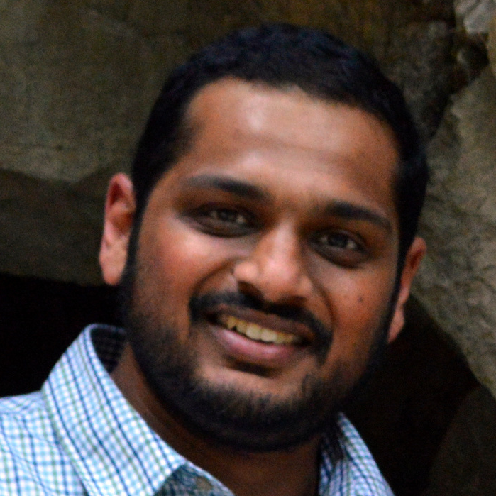

Ask your questions, and vote on others, on [sli.do](https://app.sli.do/event/awQq8cDeXyxQYFP1WnfGqB).

## Overview

Recent studies show that many NLP systems are sensitive and vulnerable to a small perturbation of inputs and do not generalize well across different datasets. This lack of robustness derails the use of NLP systems in real-world applications.
This tutorial aims at bringing awareness of practical concerns about NLP robustness. 
It targets NLP researchers and practitioners who are interested in building reliable NLP systems. 
In particular, we will review recent studies on analyzing the weakness of NLP systems when facing adversarial inputs 
and data with a distribution shift. We will provide the audience with a holistic view of

[Chapter 0: Introduction](https://xai-hcee.github.io/)
[Chapter 1: Psychological foundations of explanations](https://xai-hcee.github.io/)
[Chapter 2: Overview of XAI techniques](https://xai-hcee.github.io/)
[Chapter 3: Application-grounded human-subject evaluations](https://xai-hcee.github.io/)
[Chapter 4: Proxy evaluations through human-provided explanations](https://xai-hcee.github.io/)
[Chapter 5: Summary and future directions](https://xai-hcee.github.io/)

## Videos

## Slides
<iframe src="https://docs.google.com/presentation/d/e/2PACX-1vQObhZjgRpHPVStVU2V87P-E4LgsD764B2bY4CUOhOEhORPMXQOnKpmxmtoePFvBW81NDrCn3VaOAT8/embed?start=false&loop=false&delayms=3000" frameborder="0" width="960" height="569" allowfullscreen="true" mozallowfullscreen="true" webkitallowfullscreen="true"></iframe>

## Speakers

Jordan Boyd-Graber, Samuel Carton, Shi Feng, Q. Vera Liao, Tania Lombrozo, Alison Smith-Renner, Chenhao Tan

    

        

        

<b> Jordan Boyd-Graber</b>  UMD 

    

    

        

        

<b> Samuel Carton</b>   UChicago 

    

    

        

        

<b>Shi Feng</b>  UChicago

    

    

        

        

<b>Q. Vera Liao</b>  Microsoft

    

    

        

        

<b>Tania Lombrozo</b> Princeton

    

    

        

        

<b>Alison Smith-Renner</b> Dataminr

    

    

        

        

<b>Chenhao Tan</b> UChicago

    

